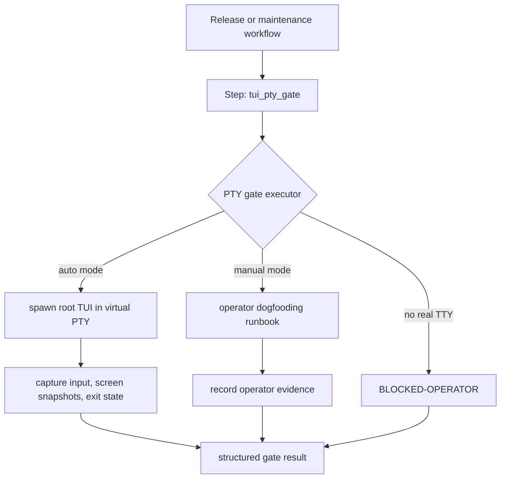

# Plan 23 — PTY operator gate as workflow capability


<!-- VAC-PLAN-STATE:BEGIN -->
## Current codebase reconciliation — 2026-05-30

Status: **COMPLETE**

Source status lines:
> ## Current status
> Status: **complete for release-policy semantics** — typed result semantics, `BLOCKED-OPERATOR` reporting, and release-gate non-pass behavior are enforced. Real TTY evidence remains an operator input for promotion, but missing/blocked evidence is a hard non-pass rather than an ambiguous implementation gap.
> - private/redacted diagnostic capture for PTY binary path, terminal size, screen-update checks, and Ctrl-C exit status,
> - Keep status non-ready until executor and evidence semantics exist.

Code evidence:
- `vac-rs/utils/pty/src/lib.rs`
- `vac-rs/cli/src/doctor/runtime_owner_gates.rs`

Evidence docs:
- `docs/workflow-control-plane/plans/23-evidence/2026-05-26-L19-real-operator-runbook.md`
- `docs/workflow-control-plane/plans/23-evidence/2026-05-27-L23OPS-operator-evidence-status.md`
- `docs/workflow-control-plane/plans/23-evidence/2026-05-28-sandbox-blocked-operator-release-policy.md`

Validation state: `targeted_or_documented`.

Caveat: full workspace build is not asserted by this reconciliation.
<!-- VAC-PLAN-STATE:END -->

## Goal

Make live terminal pseudo-terminal validation a first-class workflow-control-plane gate so TUI regressions cannot be marked release-ready without either real operator evidence or an explicit `BLOCKED-OPERATOR` record.

## Current status

Status: **complete for release-policy semantics** — typed result semantics, `BLOCKED-OPERATOR` reporting, and release-gate non-pass behavior are enforced. Real TTY evidence remains an operator input for promotion, but missing/blocked evidence is a hard non-pass rather than an ambiguous implementation gap.

The earlier version of this plan described the PTY concept and runbook, but did not define enough objective done criteria, stop conditions, output artifacts, or false-green protections. This revision is the active execution contract.

## Target outcome

The product has a `vac.tui.pty_gate` capability and a `maintenance.tui-pty-gate` workflow that validate the root interactive TUI under realistic terminal conditions.

A release gate may consume this result only when one of these is true:

- automated PTY validation passes with captured evidence, or
- a real operator runbook passes with captured evidence, or
- the environment cannot provide a real TTY and the result is recorded as `BLOCKED-OPERATOR`.

A missing TTY must never be reported as pass.

## Outputs

Expected production artifacts:

- capability manifest for `vac.tui.pty_gate`,
- workflow manifest for `maintenance.tui-pty-gate`,
- typed workflow step/executor for PTY validation with `passed`, `failed`, `blocked_operator`, and `skipped_not_applicable` result states,
- private/redacted diagnostic capture for PTY binary path, terminal size, screen-update checks, and Ctrl-C exit status,
- tests for manifest/schema parsing and blocked-operator behavior,
- release-gate integration that treats `BLOCKED-OPERATOR` as not-passed evidence,
- docs/runbook update for manual operator validation.

## Scope

Allowed scope:

- `.vac/capabilities/**` for the PTY capability manifest,
- `.vac/workflows/**` for the PTY maintenance workflow,
- `vac-rs/core/src/control_plane/**` only if implementing typed schema/executor support,
- TUI/workflow-runner surfaces only for displaying PTY gate state,
- `docs/validation/**` for operator runbook updates,
- plan/index docs.

## Non-goals

- No fake PTY pass in headless CI/tool environments.
- No broad TUI rewrite.
- No release gate bypass that treats unavailable PTY as success.
- No capture of secrets or full user environment.
- No broad `.vac/**` rewrite beyond the explicit manifests/workflows.
- No dependency on app-server retirement work.

## Requires / Blocks

Requires:

- workflow manifest/schema support from Plans 03, 06, 07, and 12,
- policy integration from Plan 14 for active process execution,
- release gate integration from Plan 18 if this gate is required for releases.

Blocks:

- release-grade confidence for TUI-heavy plans,
- Plan 30 and Plan 33 PTY evidence if local runtime owner work changes root TUI startup/exit behavior.

## Architecture



## Functional requirements

The gate must verify these behaviors when a PTY is available:

1. root `vac` launches the same product TUI used by users,
2. alternate screen enters and restores cleanly,
3. `/` opens the slash-command list without layout crash,
4. normal input reaches the composer,
5. prompt submission can be exercised when safe test credentials/config are available,
6. approval/input overlays can be exercised when a deterministic fixture exists,
7. `Ctrl-C` exits cleanly and releases terminal state,
8. captured diagnostics are private and redact sensitive environment values,
9. failures produce structured evidence for the workflow result.

## Execution slices

### 23A — Manifest contract

- Add or verify `vac.tui.pty_gate` capability manifest.
- Add or verify `maintenance.tui-pty-gate` workflow manifest.
- Keep status non-ready until executor and evidence semantics exist.

Validation:

```bash
cd vac-rs
df -h . /tmp
CARGO_BUILD_JOBS=1 CARGO_INCREMENTAL=0 cargo +1.93.0 check -p vac-core
```

### 23B — Typed PTY gate result

Implemented typed result states:

```text
passed
failed
blocked_operator
skipped_not_applicable
```

`blocked_operator` must not satisfy release pass criteria unless the release policy explicitly allows blocked evidence.

### 23C — Automated virtual PTY executor

Implemented executor launches root `vac` in a virtual PTY, observes initial screen output, sends `/`, requires a subsequent screen update, sends Ctrl-C, and blocks if Ctrl-C exit cannot be verified. Missing PTY/output is reported as `BLOCKED-OPERATOR`, never pass.

### 23D — Manual operator runbook

Update `docs/validation/TUI_PTY_DOGFOOD_GATE.md` or equivalent with a concise operator checklist and evidence format.

### 23E — Release gate integration

Wire the PTY gate into release workflow policy so missing TTY is visible and cannot become false-green.

## Validation matrix

Automated validation:

```bash
cd vac-rs
df -h . /tmp
CARGO_BUILD_JOBS=1 CARGO_INCREMENTAL=0 cargo +1.93.0 check -p vac-core
CARGO_BUILD_JOBS=1 CARGO_INCREMENTAL=0 cargo +1.93.0 check -p vac-surface-tui --tests
```

Control-plane validation should also include the registry/manifest tests that own capability and workflow parsing.

Product / operator validation:

```text
launch root vac in PTY
type /
verify slash-command list visible
verify no layout panic
submit safe input when configured
press Ctrl-C
verify exit and terminal restoration
```

If a real TTY is unavailable, record:

```text
BLOCKED-OPERATOR: no interactive TTY available in this environment
```

## Stop conditions

Stop instead of marking pass when:

- the environment has no real TTY and no virtual PTY executor is available,
- root `vac` cannot be launched without touching unrelated dirty work,
- captured output may contain secrets and no redaction path exists,
- the release gate treats `blocked_operator` as pass by default,
- slash-command visibility cannot be verified,
- Ctrl-C exit cannot be verified.

## Done criteria

Plan 23 is done only when:

- `vac.tui.pty_gate` is declared in `.vac`,
- `maintenance.tui-pty-gate` can run or explicitly report `BLOCKED-OPERATOR`,
- release/maintenance gate consumers distinguish `passed` from `blocked_operator`,
- slash-command and Ctrl-C behavior have automated or operator evidence,
- diagnostics are redacted/private,
- validation commands pass,
- docs record the evidence path and manual fallback.

## Historical notes

Earlier concept notes described:

- capability ID `vac.tui.pty_gate`,
- workflow `maintenance.tui-pty-gate`,
- alternate-screen validation,
- slash-command and Ctrl-C checks,
- manual runbook fallback.

Those ideas remain valid, but this revision is the active production-grade execution contract.


## 2026-05-28 sandbox closeout

- Release policy evidence: [23-evidence/2026-05-28-sandbox-blocked-operator-release-policy.md](23-evidence/2026-05-28-sandbox-blocked-operator-release-policy.md).
